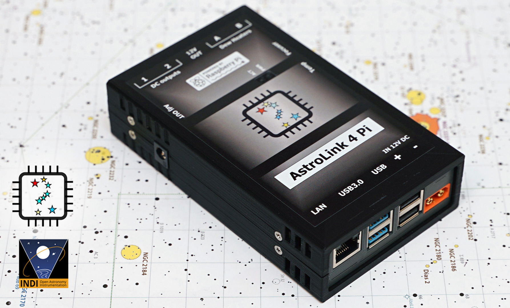
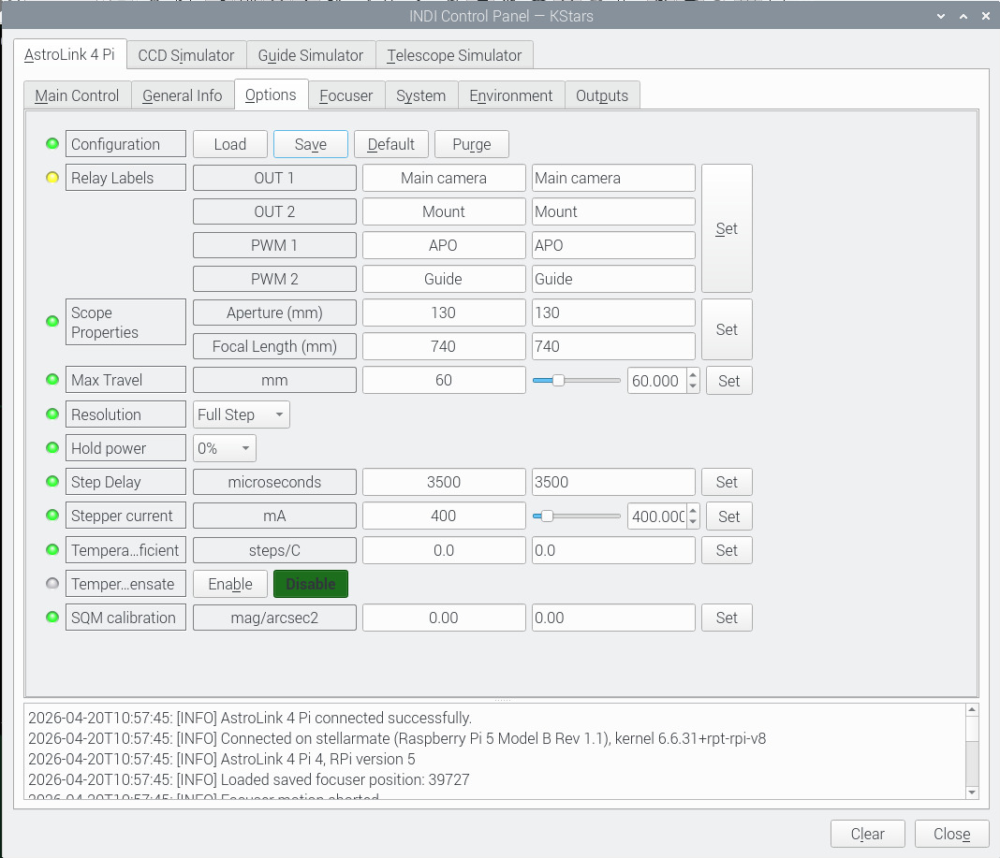
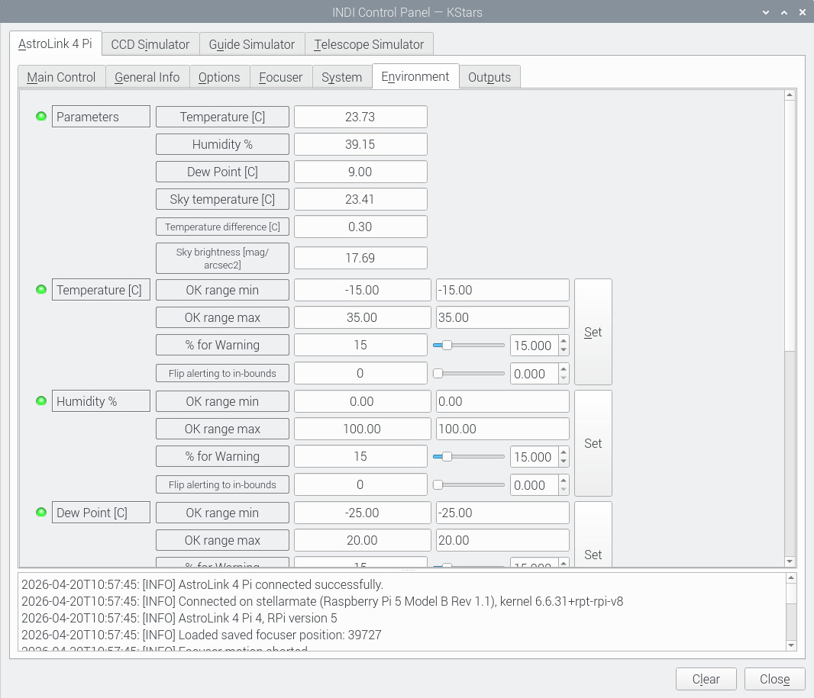

<p align="center">
  
</p>

# 🔭 AstroLink 4 Pi

AstroLink 4 Pi is an INDI driver for AstroLink hardware, designed to simplify and integrate astrophotography setups.  
It provides control over power distribution, focuser operation, environmental monitoring, and device telemetry — all in a single compact system.

🛒 [Product page](https://shop.astrojolo.com/product/astrolink-4-pi/) <br>
🔗 [INDI Library](https://indilib.org/)

---
## ⚡ Features

AstroLink 4 Pi provides:
- 🔌 Power management  
- 🔭 Focuser control  
- 🌡️ Environmental sensing  
- ⚙️ Full INDI integration  

➡️ All in one compact astrophotography controller

### 🔭 Focuser
- Stepper motor control
- Absolute and relative positioning
- DRV8825 driver support for Moonlite / Robofocus / AstroLink geared unipolar steppers and bipolar microstepping up to 1/32
- Forward / Reverse direction configuration
- Customizable maximum absolute position (steps)
- Customizable maximum focuser travel (mm)
- Backlash compensation
- Speed/current/hold torque control
- Focuser info including: critical focus zone in μm, step size in μm, steps per critical focus zone
- Automatic temperature compensation based on temperature sensor

### 🔌 Power Outputs
- Two switchable 12V DC outputs, 5A max each
- One permanent 12V DC output
- Two PWM-regulated RCA outputs, 3A max each
- One adjustable DC output 3-10V, 1.5A max
- Configurable labels

### 🌡️ Sensors & Monitoring

*(availability depends on hardware revision)*
- I2C environmental sensors
- Humidity / dew point / sky temperature / cloud coverage / sky brightness sensors support
- Voltage and current monitoring

### 🧠 System Integration
- Fully integrated with INDI ecosystem
- Works with NINA, KStars, Ekos, and other INDI clients

<p align="center">
  
</p>

---

## ⚡ Quick Start

### 📊 Requirements
- Raspberry Pi 5 (highly recommended) or Raspberry Pi 4
- 4GB RAM and Raspberry Pi approved SD card
- INDI 2.1 or higher
- supported distributions - Rasbpian based (StellarMate 1.9.x, astroberry) and Arch linux based (StellarMate 2.x, AstroArch)
- wiringPi library installed
- SPI and I2c bus enabled


### ⚡ Minimal Quick Start

The steps below are valid for **astroberry** and **StellarMate 1.9.x**.<br>
For other astronomy distributions additional prerequisites see the links below the bash code.

```bash
# install dependencies
sudo apt update
sudo apt install -y git cmake build-essential libindi-dev

# install wiringPi
cd $HOME
git clone https://github.com/WiringPi/WiringPi.git
cd WiringPi && ./build

# build driver
cd $HOME
git clone https://github.com/astrojolo/astrolink4pi.git
cd astrolink4pi
mkdir build && cd build
git checkout gpio-5
git pull
cmake ..
make -j4
sudo make install

# enable SPI, I2C
sudo raspi-config
# enable SPI and I2C interfaces
# then reboot
sudo reboot

# verify installation
indiserver -v indi_astrolink4pi
```

> ⚠️ wiringPi is deprecated but still required by this driver. New driver version without wiringPi dependency is planned for 2026 Q4.

👉 [INDI Server helper script](#-indi-server-helper-script)<br>
👉 [Additional steps for StellarMate 2.0](#-stellarmate-20-setup)<br>
👉 [Additional steps for AstroArch](#-astroarch-setup)


After installation, the driver will appear in:
```
INDI → Auxiliary devices → AstroLink 4 Pi
```
> **⚠️ Important**<br>
> Once connected to the driver, configure the settings to match your requirements. Mostly focusing motor settings and also adjust polling interval, so sensors will be updated more often than default 60 seconds.

---

## 🧰 INDI Server Helper Script

This script (`server/start_indi.sh`) simplifies running a local INDI server by loading driver names from a configurable `profile.conf` file. It supports background execution, live debugging mode with real-time logs, and basic process management (start/stop/status/restart). If the configuration file does not exist, it is automatically created with a default setup.

### 🚀 Usage

```bash
cd server
./start_indi.sh start       # start INDI server in background
./start_indi.sh startlog    # start in foreground with live logs
./start_indi.sh stop        # stop the server
./start_indi.sh status      # check if running
./start_indi.sh restart     # restart the server
```
Edit `profile.conf` to configure which INDI drivers are loaded. In Ekos, use a **Remote** profile and connect to *localhost:7624*.


<p align="center">
  
</p>

---


## 🧪 StellarMate 2.0 Setup

<details>
<summary>Click to expand</summary>

Pacman **core** and **extra** repositories must be enabled:
```bash
sudo nano /etc/pacman.conf
```
and uncomment sections **core** and **extra**. Then install required packages (first install after enabling core/extra may take significant amount of time and number of packages):
```bash
sudo pacman -Syu
sudo pacman -Syu git cmake python3 python-setuptools swig base-devel
```

Create a rules file **gpiomem, SPI and I2C** devices:
```bash
sudo nano /etc/udev/rules.d/99-zzz-astrolink4pi.rules
```
and add these lines into this file:
```bash
KERNEL=="gpiomem*", GROUP="uucp", MODE="0660"
KERNEL=="i2c-[0-9]*", GROUP="uucp", MODE="0660"
KERNEL=="spidev*", GROUP="uucp", MODE="0660"
```
Add current user to the listed group:
```bash  
sudo usermod -aG uucp $USER
```
Then reboot.<br>

**⚠️ Important - StellarMate 2.0 uses Flatpak (sandboxed environment)**

Problem:
KStars cannot access local INDI drivers

Solutions:
1. Install native KStars (recommended)
```bash
sudo pacman -Syu kstars
systemctl --user disable --now org.kde.kstars.service
```
2. Use Flatpak KStars + external indiserver<br>
👉 [Check INDI Server helper script](#-indi-server-helper-script)
</details>

---

## 🧪 AstroArch Setup

<details>
<summary>Click to expand</summary>

If you are using **AstroArch Linux**, additional steps may be required.

Typical adjustments:
- manual enabling of interfaces
- package differences
- RTC configuration

👉 Follow AstroArch-specific documentation if needed


Update system and install packages:

```bash
update-astroarch
sudo pacman -S unzip cmake python python3 python-setuptools swig
```

Add the following line to /boot/config.txt:

```bash
dtparam=spi=on
```

and modify

```bash
dtoverlay=i2c-rtc,ds1307
```

Create additional groups and add user astronaut to them:

```bash
sudo groupadd gpio
sudo groupadd spi
sudo usermod -a -G gpio astronaut
sudo usermod -a -G i2c astronaut
sudo usermod -a -G spi astronaut
```

Create /etc/udev/rules.d/99-gpio.rules file with content:

```bash
SUBSYSTEM=="gpio", KERNEL=="gpiochip*", GROUP:="gpio", MODE:="0660"
SUBSYSTEM=="spidev", KERNEL=="spidev*", GROUP:="spi", MODE:="0660"
```

Then you may go directly to AstroLink 4 Pi INDI driver installation.
</details>

---

## 📊 Compatibility Matrix

| Device Revision | Raspberry Pi | Driver Branch | Notes |
|----------------|-------------|--------------|------|
| Rev 4 | Pi 4 / Pi 5 | `main` | Full support |
| Rev 3 | Pi 4 / Pi 5 | `main` | Full support |
| Rev 2 | Pi 4 only | `main` | Legacy hardware |
| Rev 1 | Pi 4 only | `main` | Limited support |


---

## ⚠️ Compatibility Notes

- Requires **wiringPi** 
- Tested on Raspberry Pi 4 and 5
- Older INDI versions may not work correctly

---

## 🔧 Troubleshooting

#### Driver is not appearing in Ekos driver selector
- make sure driver installation went correct including `sudo make install` command
- if Kstars in Flatpak is used, the drivers can be accessed only remotely

#### SPI / I2C permission denied
- make sure the file with rules was created for `/dev/gpiomem*` `/dev/spidev*` `/dev/i2c*`
- make sure these interfaces were enabled in `raspi-config`

#### wiringPi not found by CMake
- install wiringPi - from package or sources

#### Flatpak KStars cannot see locally installed driver
- use driver started from the external INDI server
- install KStars locally from the official repository and disable Flatpak version 

#### Sensors not updating
- default polling period in INDI driver is 60s, adjust it to 3-5s to have readings more often

---


## 🤝 Contributing

Contributions, bug reports, and suggestions are welcome!

If you find an issue:
- open a GitHub issue
- include logs and hardware revision
- describe your setup (Pi version, OS, INDI version)

---

## 📄 License

This project is released under the terms specified in the repository.